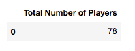
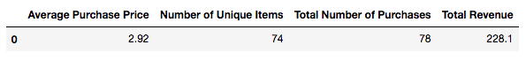
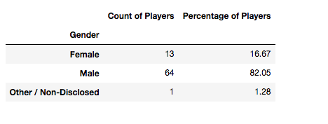
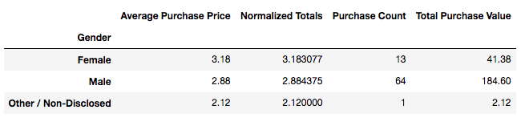
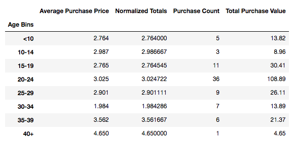
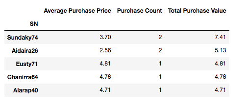
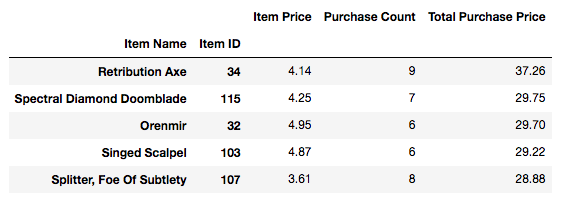

# Heroes of Pymoli Game - Report & Stats

## The Purpose
We live in times where App stores have gotten really popular. Thus this project was done to generate a report on a sample game's user base. For this project, the user data of a game called Heroes of Pymoli were analyzed to generate a report.

## Learnings 
SQL has been the primary source of data fetching/pulling and is used everywhere to generate reports. But in the recent times, pandas and python have been a significant replacement of SQL. Thus this project was done using pandas and python.

## Analysis
Below is the analysis that was done on the user data. The main file folder has the code that was written to do the analysis and the markdown version of the report.

**Player Count**
* Total Number of Players

**Result**

**Purchasing Analysis (Total)**

* Number of Unique Items
* Average Purchase Price
* Total Number of Purchases
* Total Revenue

**Result**

**Gender Demographics**

* Percentage and Count of Male Players
* Percentage and Count of Female Players
* Percentage and Count of Other / Non-Disclosed

**Result**

**Purchasing Analysis (Gender)** 

* The below each broken by gender
* Purchase Count
* Average Purchase Price
* Total Purchase Value
* Normalized Totals

**Result**

**Age Demographics**

* The below each broken into bins of 4 years (i.e. &lt;10, 10-14, 15-19, etc.) 
* Purchase Count
* Average Purchase Price
* Total Purchase Value
* Normalized Totals

**Result**

**Top Spenders**

* Identify the the top 5 spenders in the game by total purchase value, then list (in a table):
* SN
* Purchase Count
* Average Purchase Price
* Total Purchase Value

**Result**

**Most Popular Items**

* Identify the 5 most popular items by purchase count, then list (in a table):
* Item ID
* Item Name
* Purchase Count
* Item Price
* Total Purchase Value

**Result**

**Most Profitable Items**

* Identify the 5 most profitable items by total purchase value, then list (in a table):
* Item ID
* Item Name
* Purchase Count
* Item Price
* Total Purchase Value

**Result**

